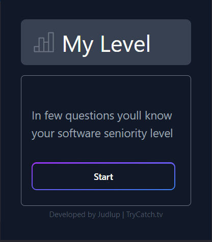
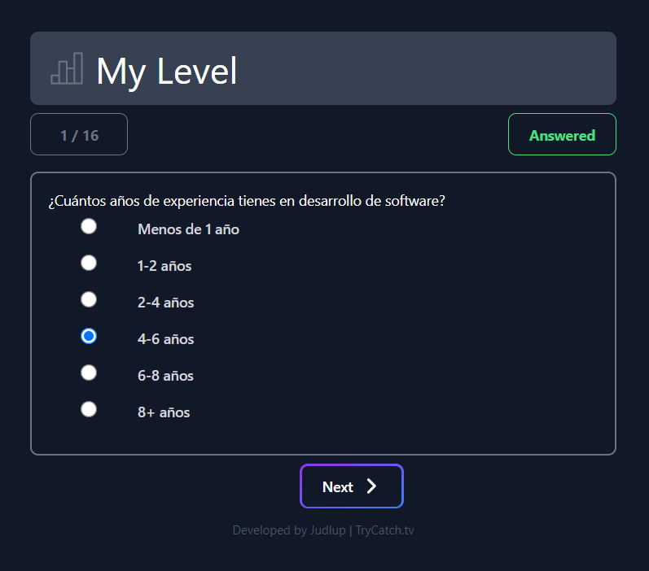

# My Level

Este proyecto consiste en una extensión de Google Chrome que ayuda a los desarrolladores de software a evaluar su nivel de seniority a través de una serie de preguntas.

## Chrome Web Store

[My-Level](https://chrome.google.com/webstore/detail/my-level/mbdaaoibdkddnkadkpjakclfhfogenma)

## Características

- Realiza una serie de preguntas relevantes al usuario para entender su nivel de habilidad y experiencia.
- Categoriza a los usuarios en diferentes niveles de seniority según sus respuestas.
- Ofrece una interfaz de usuario intuitiva y fácil de usar.

## Cómo usar

1. Instale la extensión en su navegador Google Chrome.
2. Haga clic en el icono de la extensión en la barra de herramientas de Chrome para iniciarla.
3. Responda las preguntas presentadas por la extensión.
4. Reciba una evaluación de su nivel de seniority basada en sus respuestas.

## Tecnologías utilizadas

- React
- Vite
- Tailwind CSS
- SCSS
- Google Chrome Extension API

## Capturas de pantalla

)

## Instalación

1. Clone este repositorio.
2. Ejecute `npm install` para instalar las dependencias necesarias.
3. Ejecute `npm run build` para construir el proyecto para producción.
4. Cargue la extensión en Google Chrome a través de la página de extensiones (chrome://extensions/).
5. Habilite la extensión.

## Todo

- [ ] Implementar Zustand.
- [ ] Mejorar código.
- [ ] Persistencia en los datos.
- [ ] Sugerencia de contenido de acuerdo al nivel.

## Contribución

Si desea contribuir a este proyecto, por favor realice un "fork" de este repositorio y envíe un "pull request" para cualquier cambio que desee sugerir. Asegúrese de proporcionar una descripción detallada de los cambios y las razones para los mismos.

## Licencia

Este proyecto está licenciado bajo los términos de la licencia GPL versión 3.

## Contacto

Si desea contactarme, puede hacerlo a través de mi correo electrónico: [judlup@trycatch.tv](mailto:judlup@trycatch.tv)

- [@TryCatch.tv](https://www.tiktok.com/@trycatch.tv)
- [Judlup](https://www.linkedin.com/in/judlup/)
- [Linktr.ee](https://linktr.ee/trycatch.tv)
